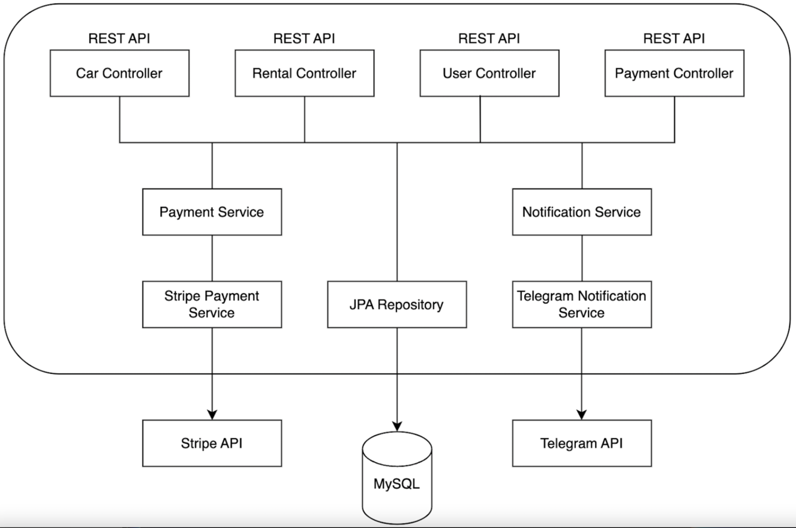

# Car Sharing Service project description

There is a car sharing service in your city, where you can rent cars and pay for your usage using cash, depending on the
duration of your rental.

The problem is, the system for tracking cars, rentals, users, and payments in the car sharing service is outdated -
everything is managed manually and all records are kept on paper. There is no way to check the availability of specific
cars in the service. Additionally, you can only make payments with cash; there is no support for credit cards. The car
sharing service administration has no way of knowing who returned the car on time and who did not.

In this project, you will be addressing all these issues. Your task is to implement an online management system for car
rentals. This system will streamline the work of the service administrators and greatly enhance the user experience.

## App

### Requirements:

- Functional (what the system should do):
    - Web-based
    - Manage car sharing inventory
    - Manage car rentals
    - Manage customers
    - Display notifications
    - Handle payments
- Non-functional (what the system should deal with):
    - Support up to 5 concurrent users
    - Manage up to 1000 cars
    - Handle 50,000 rentals per year
    - Approximately 30MB of data per year

### Architecture

### Models

1. Car:
    - Model: String
    - Brand: String
    - Type: Enum: SEDAN | SUV | HATCHBACK | UNIVERSAL
    - Inventory (the number of this specific car available for now in the car sharing service): int
    - Daily fee: decimal (in $USD)
2. User (Customer):
    - Email: String
    - First name: String
    - Last name: String
    - Password: String
    - Role: Enum: MANAGER | CUSTOMER
3. Rental:
    - Rental date: LocalDate
    - Return date: LocalDate
    - Actual return date: LocalDate
    - Car id: Long
    - User id: Long
4. Payment:
    - Status: Enum: PENDING | PAID
    - Type: Enum: PAYMENT | FINE
    - Rental id: Long
    - Session url: Url # URL for the payment session with a payment provider
    - Session id: String # ID of the payment session
    - Amount to pay: decimal (in $USD)  # calculated rental total price

### Controllers

1. Authentication Controller:
    - POST: /register - register a new user 
    - POST: /login - get JWT tokens

2. Users Controller: Managing authentication and user registration
    - PUT: /users/{id}/role - update user role
    - GET: /users/me - get my profile info
    - PUT/PATCH: /users/me - update profile info

3. Cars Controller: Managing car inventory (CRUD for Cars)
    - POST: /cars - add a new car
    - GET: /cars - get a list of cars
    - GET: /cars/<id> - get car's detailed information
    - PUT/PATCH: /cars/<id> - update car (also manage inventory)
    - DELETE: /cars/<id> - delete car

4. Rentals Controller: Managing users' car rentals
    - POST: /rentals - add a new rental (decrease car inventory by 1)
    - GET: /rentals/?user_id=...&is_active=... - get rentals by user ID and whether the rental is still active or not
    - GET: /rentals/<id> - get specific rental
    - POST: /rentals/<id>/return - set actual return date (increase car inventory by 1)

5. Payments Controller (Stripe): Facilitates payments for car rentals through the platform. Interacts with Stripe API.
   Use stripe-java library.
    - GET: /payments/?user_id=... - get payments
    - POST: /payments/ - create payment session
    - GET: /payments/success/ - check successful Stripe payments (Endpoint for stripe redirection)
    - GET: /payments/cancel/ - return payment paused message (Endpoint for stripe redirection)

6. Notifications Service (Telegram):
    - Notifications about new rentals created, overdue rentals, and successful payments
    - Other services interact with it to send notifications to car sharing service administrators.
    - Uses Telegram API, Telegram Chats, and Bots.

## Tasks

### Infrastructure

+ Create a project
+ Add maven checkstyle plugin
+ Configure CI process
+ Add liquibase support
- Add health check controller
- Add Docker and docker-compose support
- Use .env file in the docker with all sensitive information and push only .env.sample with a skeleton data from .env
  file.
- Add swagger documentation to project
- Fulfill README.md after project finalization

### Implement CRUD functionality for Car Service

- Add car table into DB
- Create entity Car
- Implement controllers for all endpoints
- Add permissions to Car Controller
    - Only admin users can create/update/delete cars
    - All users (even those not authenticated) should be able to list cars
- Use JWT token authentication for users' service

### Implement CRUD for Users Service

- Add user table into DB
- Add user entity
- Add JWT support
- Implement all controllers endpoints

### Implement Rental List & Detail endpoint

- Add rental table into DB with constraints for rental date, return date, and actual return date
- Add rental entity
- Implement a get mapper with detailed car info
- Implement list & detail endpoints
- Validate car availability (inventory is not 0)
- Attach the current user to the rental\

### Add filtering for the Rental List endpoint

- Ensure all non-admins can only see their rentals
- Ensure rentals are available only for authenticated users
- Add the `is_active` parameter for filtering active rentals (not yet returned)
- Add the `user_id` parameter for admin users, allowing them to see all users' rentals if not specified. If
  specified, show rentals only for the specific user.

### Implement the return Rental functionality

- Ensure a rental cannot be returned twice
- Increase car inventory by 1 upon return
- Add an endpoint for returning a rental

### Implement the possibility of sending notifications on each rental creation

- Set up a Telegram chat for posting notifications
- Set up a Telegram bot for sending notifications (Each team member will have their own telegram bot)
- Explore the `sendMessage` function interface in the Telegram API
- Ensure all private data remains private and never enters the GitHub repository. (Use env variables in the .env file
  for all secret data)
- Create a separate service (Telegram Notification Service) which will implement a NotificationService interface for
  sending messages.
- Integrate sending notifications on new rental creation, providing information about the rental in the message

### Implement a daily-based function for checking overdue rentals

- The function should filter all rentals that are overdue (return date is tomorrow or earlier, and the car is still
  not returned) and send a notification to the Telegram chat for each overdue rental with detailed information
- This will be a scheduled task, you'll need to use a @Scheduled annotation.
- If no rentals are overdue for that day, send a "No rentals overdue today!" notification.

### Payments Endpoint

- Add Payment table into DB and Payment entity
- Create controllers for list and functional endpoints
- Ensure customers can only see their payments, while managers can see all of them

### Create your first Stripe Payment Session (manual)

- Refer to the Stripe documentation to understand how to work with payments
- Create an account on Stripe. Activating your Stripe account is not necessary; Use only test data. You should not
  work with real money in this project
- Try to create your first Stripe Session (you can use an example from the documentation) to understand how it
  works.

### Automate the process of creating Stripe Payment Sessions

- Ensure your Stripe secret keys are kept secret and not pushed to GitHub
- Implement a create payment session endpoint, which will receive a dto with only rental id and payment type to
  create a new Stripe Session for it. Calculate the total price of the rental and set it as the unit amount. If the
  payment type is FINE create a FINE Payment with a preconfigured FINE_MULTIPLIER. (Remember about SRP and design
  patterns)
- Calculate the moneyToPay for the payment as the "number of overdue days" multiplied by the daily fee multiplied by
  the FINE_MULTIPLIER.
- When creating a session, provide the correct links to the success and cancel endpoints
- Use `UriComponentsBuilder` to build the URLs dynamically
- Set the quantity as 1 since we allow renting only 1 car at a time
- Create a Payment and store the session URL and session ID. Attach the rental to the Payment
- Leave the success and cancel URLs as default for now. They will be handled later
- The paymentResponseDto must be returned from this endpoint.

### Implement success and cancel URLs for Payment Service

- Refer to the tutorial to understand how to work with the success endpoint
- Create a success action that checks whether the Stripe session was successfully paid
- If the payment was successful, mark it as paid
- Create a cancel endpoint that informs the user that the payment can be made later (but the session is available
  for only 24 hours)

### Optional:

- Keep track of expired Stripe sessions
    - Add each-minute scheduled task for checking Stripe Session for expiration
    - If the session is expired - Payment should be also marked as EXPIRED (new status)
    - The user should be able to renew the Payment session (new endpoint)
- Do not allow users to borrow new books if at least one pending payment for the user
    - Before creating borrowing - simply check the number of pending payments
    - If at least one exists - forbid borrowing
- Send a notification to the telegram chat on each successful Payment with its details
    - If payment was paid - just send the notification to the telegram chat

### Advanced

- Deploy your app to the AWS

